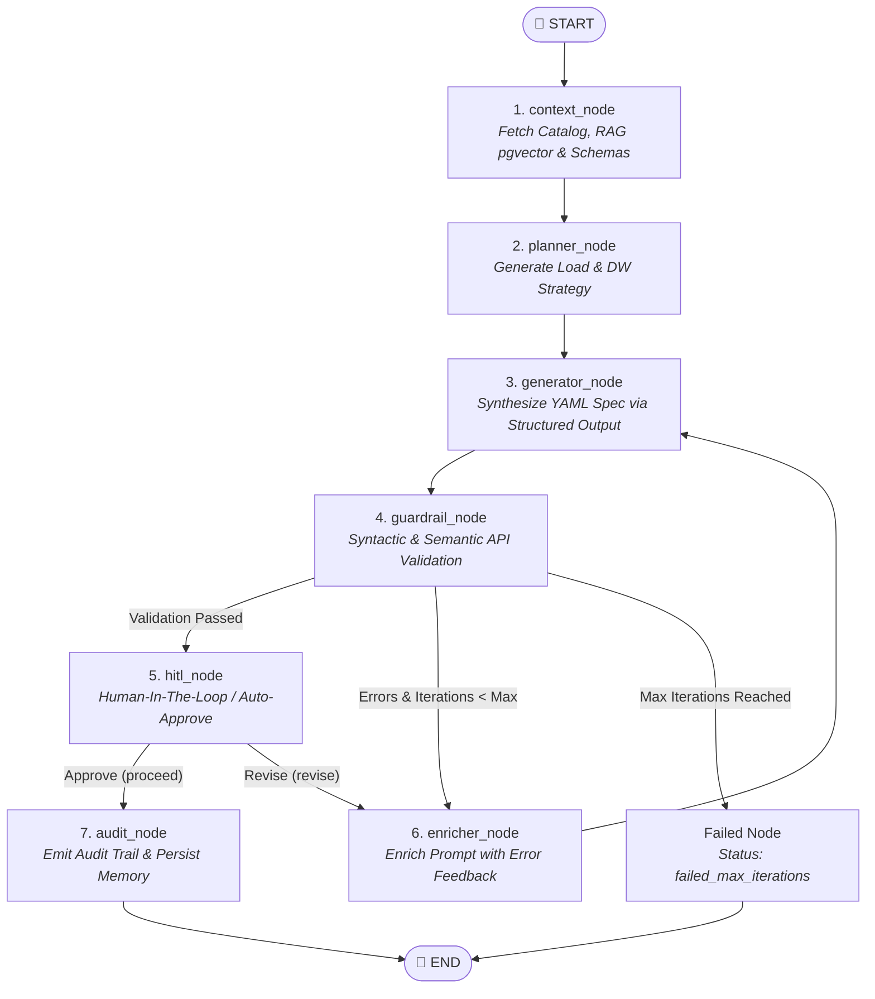

# YAML Harness Engine AI 🚀

> Autonomous AI Engine based on **Harness Engineering**, **LangGraph**, **Vector RAG (pgvector)**, **Model Context Protocol (MCP)**, and **Clean Architecture** for deterministic generation, validation, and self-refinement of data pipeline specifications in YAML.

---

## 📌 Overview & Study Motivation

The **`pipeline-harness-ai`** project was developed as a **deep study and practical experimentation lab** in software systems engineering with generative AI. Its goal is to act as the YAML specification generator for the [`clean-data-platform-airflow`](https://github.com/Melo-Anderson/clean-data-platform-airflow) platform, translating natural language prompts into valid, optimized, and directly executable data pipeline specifications.

The core motivation of this lab was to explore and test the boundaries of modern industry patterns in real code:
1. **Harness Engineering & Feedback Loop:** Replacing subjective LLM evaluations with **deterministic guardrails and automated tests** running against real platform APIs and contracts.
2. **Graph Engineering:** Evaluating agent workflow orchestration as typed state graphs in **LangGraph**.
3. **Vector Memory & Anti-Drift RAG:** Implementing canonical gold example persistence using **pgvector** and provider-agnostic embeddings to ground code generation.
4. **Model Context Protocol (MCP):** Exposing engine tools and resources directly to modern AI assistants and IDEs (Cursor, Claude Desktop, VS Code).

---

## 📸 Real End-to-End Execution Demo

Below is the execution of the complete autonomous LangGraph workflow in the terminal, deterministically generating and validating the final YAML specification:


---

## 🔄 LangGraph Orchestration Flow

The engine utilizes a typed state graph (`HarnessState`) in **LangGraph** composed of 7 primary nodes with conditional branching:



---

## 🛠️ Node Breakdown & Harness Engineering

| Node | Responsibility | Guardrails, RAG & Adaptation Mechanisms |
|---|---|---|
| **1. `context_node`** | Multidimensional Retrieval & RAG | Queries relational catalog (`DbSchemaReader`), historical volumetric metrics (`StorageMetricsReader`), JSON Schema contracts (`HttpPlatformReader`), and performs **cosine semantic search in `pgvector`** (`PgVectorStorageAdapter` + `EmbeddingPort`) with transparent fallback to the platform API. |
| **2. `planner_node`** | DW Strategy & Planning | Decomposes user intent into a structured `PipelinePlan`, choosing load strategy (`full_load`, `incremental`, `cdc`), compute engine, partitioning columns, and PII governance requirements. |
| **3. `generator_node`** | Structured LLM Generation | Uses **Structured Output (Pydantic v2)** via `PipelineSpec`, dynamically injecting canonical gold examples retrieved via RAG into a specialized synthesis prompt. |
| **4. `guardrail_node`** | Deterministic External Validation | Submits generated YAML directly to the platform REST API (`POST /v1/harness/validate`), ensuring full compliance with live contracts and CI rules. |
| **5. `enricher_node`** | Corrective Feedback Loop | On validation failures, formats error codes and structured *JSON Pointers* to guide the LLM through self-correction iterations. |
| **6. `hitl_node`** | Human-In-The-Loop (HITL) | Supports interactive human review via CLI or programmatic automated approval. |
| **7. `audit_node`** | Audit & Vector Memory | Writes the final YAML specification, exports an immutable JSON audit log (`AuditTrail`), and persists newly approved examples into the vector store to continuously feed the RAG system. |

---

## 🧠 Vector Memory (RAG with `pgvector`) & MCP Server

As part of this study's ongoing evolution, two major infrastructure capabilities were introduced:

### 1. Semantic RAG with `pgvector` & Alembic
- **Dedicated Schema (`harness`):** `gold_pipeline_embeddings` table with `vector(1536)` extension managed via Alembic migrations.
- **Agnostic Embedding Factory:** Decoupled support for multiple embedding providers (`openai`, `google-genai`, deterministic `fake`) via `embedding_factory.py`.
- **Synchronization & Anti-Drift:** Reindexing mechanisms to synchronize and revalidate canonical platform YAMLs against contract updates.

### 2. Model Context Protocol (MCP) Server
The project exposes a **FastMCP** server in `src.infrastructure.mcp.server`, allowing modern AI coding assistants and IDEs (Cursor, Claude Desktop, VS Code) to consume harness capabilities natively:
- **MCP Tools:** `get_table_schema`, `get_gold_examples`, `validate_pipeline_yaml`, `generate_pipeline_yaml`.
- **MCP Resources:** `schema://{pipeline_type}`, `catalog://{asset_name}`, `audit://{run_id}`.

---

## 🏗️ Architecture Pillars & Quality Standards

- **Clean Architecture (Ports & Adapters):** Complete isolation of business rules in `domain/`. Infrastructure adapters (SQLAlchemy, pgvector, HTTP Clients, File Storage) implement interfaces declared in `domain/ports.py`.
- **Pluggable AI Providers:** LLMs and Embeddings are instantiated via decoupled factories (`llm_factory` and `embedding_factory`), supporting multiple providers without vendor lock-in.
- **Autonomous Feedback Loop:** The agent self-corrects based on deterministic validation responses from the platform API.
- **Python 3.12+ & Modern Tooling:**
  - Ultra-fast dependency management with [`uv`](https://github.com/astral-sh/uv).
  - Strict static typing (`mypy`).
  - High-performance linter and formatter (`ruff`).
  - Comprehensive unit, integration, and E2E test suite (`pytest`).

---

## 💡 Architectural Takeaways: Study Lessons vs. Production Simplification

Hands-on experimentation with this project allowed contrasting popular AI orchestration patterns with traditional software engineering realities, clearly distinguishing **essential complexity** (what delivers real value) from **accidental complexity** (structures that can be streamlined in a production environment).

### 🎯 What Works Exceptionally Well (Essential Complexity)
- **Harness with Deterministic Validation:** System reliability does not come from having one LLM evaluate another LLM through subjective text or natural language prompts. It comes from the **platform compiler/test API** (`POST /v1/harness/validate`) and Pydantic schemas. This deterministic feedback loop (*generate → test with compiler → fix with exact error pointers*) is the solid foundation ensuring functional code in production.
- **Factual Grounding (Catalog + `pgvector` RAG):** Feeding the model real column metadata and approved canonical examples eliminates the need for the model to "guess" internal schemas and conventions.
- **Clean Architecture & Decoupling:** Strict separation of ports and adapters enabled precise network mocking and seamless swapping of LLM/embedding providers without modifying core application logic.

### ⚙️ What Could Be Simplified in a Similar Production Project (Cost & Complexity Reduction)
- **Unified `Planner` and `Generator` (Single-Pass Generation):**
  - *In the study:* Splitting planning (`planner_node`) and YAML generation (`generator_node`) into two sequential LLM calls helped isolate DW decision logic.
  - *In production:* To optimize costs, reduce end-to-end latency, and mitigate cumulative failure rates across chained steps, planning and YAML synthesis can be unified into a single inference call with *Structured Output*, substantially lowering token consumption and response times.
- **Native Code Loop vs. Graph Overhead:**
  - *In the study:* LangGraph was used to explicitly map each node, edge, and state transition.
  - *In production:* For workflows that are essentially linear with conditional retries (*fetch context → generate spec → validate against API → retry if invalid*), a simple native `while/for` loop in pure Python would achieve identical efficacy while drastically reducing framework dependencies and ecosystem maintenance overhead.
- **Asynchronous Human-in-the-Loop:**
  - In automated corporate workflows, interactive terminal prompts (`hitl_node`) can be replaced by asynchronous events (such as Git Pull Requests or CI/CD Webhooks).

---

## 🚀 How to Run

### 1. Environment Setup

```bash
cp .env.example .env
uv sync
```

### 2. End-to-End Test (Full Platform Workflow)

```bash
# Run End-to-End test connecting to platform mock services
uv run python scripts/test_e2e.py --prompt "Create incremental ingestion pipeline for CustomerCreate API in asset e2e-api-store-mock-asset"
```

### 3. CLI Interface (Typer & Rich)

```bash
# Generate specification via CLI
uv run python -m src.infrastructure.cli generate "Ingest sales table daily at 6am"

# Reindex gold examples in pgvector
uv run python -m src.infrastructure.cli reindex-gold-examples
```

### 4. FastMCP Server (Model Context Protocol)

```bash
# STDIO Mode (for Cursor / Claude Desktop / VS Code)
uv run python -m src.infrastructure.mcp.server

# SSE Mode (for HTTP microservices)
uv run python -m src.infrastructure.mcp.server --transport sse --port 8001
```

### 5. REST API (FastAPI)

```bash
# Start FastAPI server
uv run uvicorn src.infrastructure.api.app:app --reload

# POST Request
curl -X POST http://localhost:8000/api/v1/generate-yaml \
  -H "Content-Type: application/json" \
  -d '{"prompt": "Ingest Oracle sales table"}'
```

### 6. Run Test Suite

```bash
# Run full unit, integration, and MCP test suite (94 tests)
uv run pytest
```

---

## ⚙️ Environment Variables

| Variable | Required | Default | Description |
|---|---|---|---|
| `OPENAI_API_KEY` | No | — | OpenAI API Key (if provider is `openai`) |
| `OPENAI_MODEL` | No | `gpt-4o` | OpenAI language model name |
| `GOOGLE_API_KEY` | No | — | Google Gemini API Key (if provider is `google-genai`) |
| `LLM_PROVIDER` | No | `openai` | LLM Provider (`openai`, `google-genai`, `fake`) |
| `EMBEDDING_PROVIDER` | No | `openai` | Embedding Provider (`openai`, `google-genai`, `fake`) |
| `EMBEDDING_MODEL` | No | `text-embedding-3-small` | Embedding model name |
| `PLATFORM_DB_URL` | Yes | — | PostgreSQL DSN for platform metadata and `harness` schema (pgvector) |
| `METRICS_STORAGE_PATH` | No | `./data/metrics` | Directory path for JSON volumetric metrics |
| `MAX_ITERATIONS` | No | `3` | Maximum loop iterations for guardrail self-correction |
| `LANGSMITH_API_KEY` | No | — | API key for LangSmith tracing |
