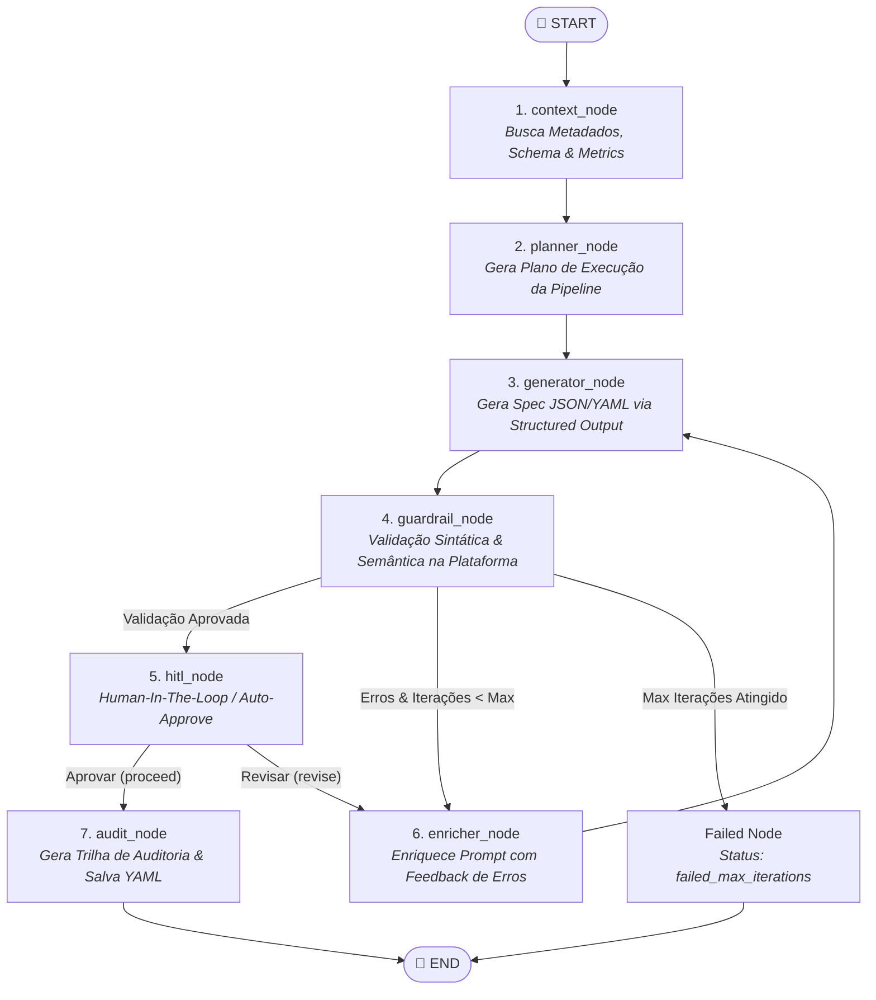

# YAML Harness Engine AI 🚀

> Motor de IA autônomo baseado em **LangGraph**, **Harness Engineering** e **Clean Architecture** para geração, validação determinística e refinamento autônomo de especificações de pipeline em YAML.

---

## 📌 Visão Geral & Motivação

O **`pipeline-harness-ai`** atua como o motor gerador de especificações YAML para a plataforma [`clean-data-platform-airflow`](https://github.com/Melo-Anderson/clean-data-platform-airflow), convertendo prompts em linguagem natural em especificações de pipeline válidas, otimizadas e executáveis.

Este projeto aplica conceitos avançados de **Harness Engineering** para garantir que a LLM opere sob guardrails rígidos de validação sintática e semântica, integrando-se diretamente às APIs de validação e catálogos de metadados da plataforma de dados.

---

## 📸 Demonstração de Execução Real E2E

Abaixo está a execução do fluxo autônomo completo do LangGraph no terminal, validando e gerando o YAML final de forma determinística:


---

## 🔄 Fluxo de Orquestração do LangGraph

O motor utiliza um grafo de estados tipado (`HarnessState`) no **LangGraph** composto por 7 nós principais e bifurcações condicionais:



---

## 🛠️ Detalhamento dos Nós e Harness Engineering

| Nó | Responsabilidade | Mecanismos de Guardrail & Adaptação |
|---|---|---|
| **1. `context_node`** | Recuperação de Metadados & Contexto | Consulta o catálogo de metadados (`DbSchemaReader`), métricas históricas de volumetria (`StorageMetricsReader`), JSON Schemas e exemplos poucos-tiros (*few-shot*) da API (`HttpPlatformReader`). |
| **2. `planner_node`** | Planejamento da Pipeline | Decompõe o prompt em um plano estruturado (`PipelinePlan`), definindo estratégias de ingestão/ETL/exportação antes da geração do código. |
| **3. `generator_node`** | Geração Estruturada LLM | Utiliza **Structured Output (Pydantic)** via `PipelineSpec` com fallback automático de identificadores (`pipeline_id`) usando regex limpos de ativos. |
| **4. `guardrail_node`** | Validação Externa Determinística | Submete o YAML gerado diretamente para a API REST da Plataforma (`POST /v1/harness/validate`), garantindo validação em tempo real contra contratos reais. |
| **5. `enricher_node`** | Loop de Feedback Sintático/Semântico | Em caso de falha na validação, extrai os erros específicos e injeta-os no histórico da LLM em iterações consecutivas para autocorreção. |
| **6. `hitl_node`** | Human-In-The-Loop (HITL) | Permite intervenção humana e revisão manual do YAML gerado com prompt interativo ou modo auto-aprovação programática. |
| **7. `audit_node`** | Persistência & Trilha de Auditoria | Grava a especificação YAML final e exporta o histórico de iterações em JSON (`AuditTrail`) no diretório `./out/`. |

---

## 🏗️ Pilares de Arquitetura & Qualidade

- **Clean Architecture (Ports & Adapters):** Isolamento total das regras de negócio em `domain/`. Adaptações de infraestrutura (SQLAlchemy, HTTP Clients, File Storage) implementam interfaces declaradas em `domain/ports.py`.
- **Validação Autônoma em Loop:** O agente corrige seus próprios erros com base em respostas de erro da API de validação real da plataforma.
- **Python 3.12+ & Ferramental Moderno:**
  - Gerenciamento ultra-rápido de dependências com [`uv`](https://github.com/astral-sh/uv).
  - Tipagem estática rigorosa (`mypy`).
  - Linter e formatador de alto desempenho (`ruff`).
  - Suíte completa de testes de unidade, integração e E2E (`pytest`).

---

## 🚀 Como Executar

### 1. Configuração do Ambiente

```bash
cp .env.example .env
uv sync
```

### 2. Teste E2E (Fluxo Completo da Plataforma)

```bash
# Executa o teste End-to-End conectando aos serviços da plataforma
uv run python scripts/test_e2e.py --prompt "Criar pipeline de ingestao incremental para a api CustomerCreate do asset e2e-api-store-mock-asset"
```

### 3. Interface CLI (Typer & Rich)

```bash
# Gerar especificação via terminal
uv run python -m harness_engine.cli generate "Ingest sales table daily at 6am"

# Gerar e salvar em arquivo YAML
uv run python -m harness_engine.cli generate "ETL with dbt" --save-to pipeline.yaml
```

### 4. API REST & Streaming SSE (FastAPI)

```bash
# Iniciar o servidor FastAPI
uv run uvicorn src.infrastructure.api.app:app --reload

# Requisição POST
curl -X POST http://localhost:8000/api/v1/generate-yaml \
  -H "Content-Type: application/json" \
  -d '{"prompt": "Ingest Oracle sales table"}'
```

### 5. Executar Suíte de Testes

```bash
# Executar todos os testes de unidade e integração (68 testes)
uv run pytest
```

---

## ⚙️ Variáveis de Ambiente

| Variável | Obrigatório | Padrão | Descrição |
|---|---|---|---|
| `OPENAI_API_KEY` | Sim | — | Chave de API da OpenAI |
| `OPENAI_MODEL` | Não | `gpt-4o` | Modelo de linguagem a ser utilizado |
| `PLATFORM_DB_URL` | Sim | — | DSN SQLAlchemy de leitura para metadados da plataforma |
| `METRICS_STORAGE_PATH` | Não | `./data/metrics` | Direto de armazenamento de métricas em JSON |
| `MAX_ITERATIONS` | Não | `3` | Limite máximo de tentativas do loop de guardrails |
| `LANGSMITH_API_KEY` | Não | — | Chave para rastreamento no LangSmith |
