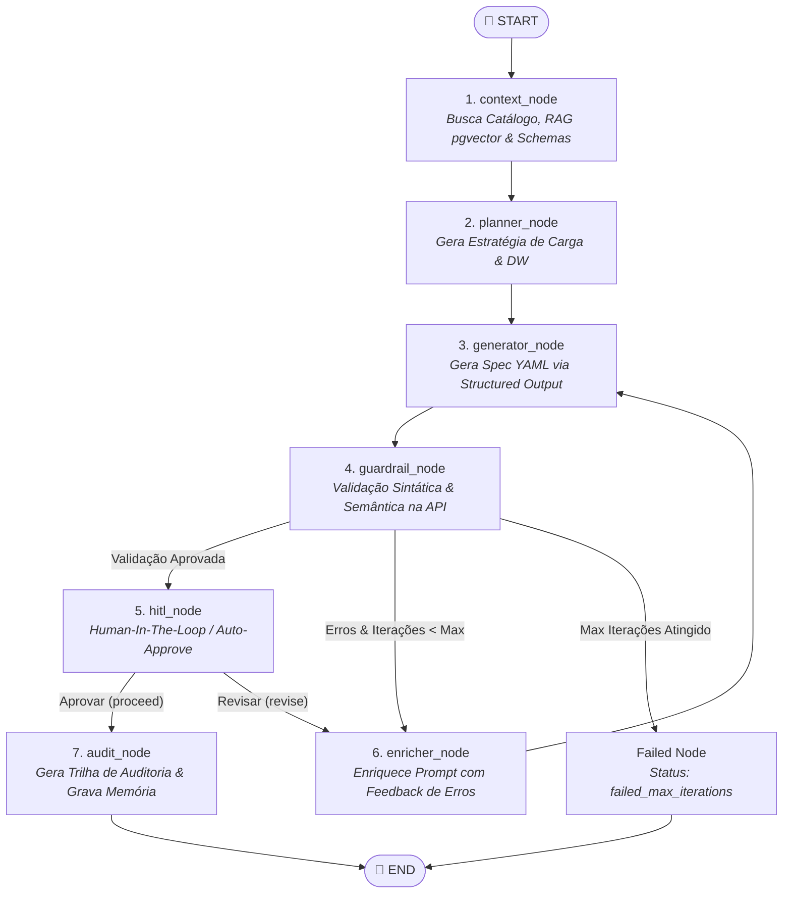

# YAML Harness Engine AI 🚀

> Motor de IA autônomo baseado em **Harness Engineering**, **LangGraph**, **RAG Vetorial (pgvector)**, **Model Context Protocol (MCP)** e **Clean Architecture** para geração, validação determinística e refinamento autônomo de especificações de pipeline de dados em YAML.

---

## 📌 Visão Geral & Motivação do Estudo

O **`pipeline-harness-ai`** foi desenvolvido como um **projeto de estudo e experimentação prática profunda** em engenharia de sistemas com IA generativa. Seu objetivo é atuar como o motor gerador de especificações YAML para a plataforma [`clean-data-platform-airflow`](https://github.com/Melo-Anderson/clean-data-platform-airflow), convertendo prompts em linguagem natural em especificações de pipeline válidas, otimizadas e diretamente executáveis.

A motivação central deste laboratório foi explorar e testar em código real os limites de padrões modernos da indústria:
1. **Harness Engineering & Loop de Feedback:** Substituir avaliações subjetivas de LLMs por **guardrails determinísticos e testes automatizados** contra APIs e contratos reais da plataforma.
2. **Graph Engineering:** Avaliar a estruturação de fluxos de agentes como grafos de estado tipados no **LangGraph**.
3. **Memória Vetorial & RAG Anti-Drift:** Implementar persistência de exemplos canônicos com **pgvector** e embeddings agnósticos para ancorar (*grounding*) a geração de código.
4. **Model Context Protocol (MCP):** Expor ferramentas e recursos do motor de engenharia diretamente para assistentes e IDEs modernas (Cursor, Claude Desktop, VS Code).

---

## 📸 Demonstração de Execução Real E2E

Abaixo está a execução do fluxo autônomo completo do LangGraph no terminal, validando e gerando o YAML final de forma determinística:


---

## 🔄 Fluxo de Orquestração do LangGraph

O motor utiliza um grafo de estados tipado (`HarnessState`) no **LangGraph** composto por 7 nós principais e bifurcações condicionais:



---

## 🛠️ Detalhamento dos Nós e Harness Engineering

| Nó | Responsabilidade | Mecanismos de Guardrail, RAG & Adaptação |
|---|---|---|
| **1. `context_node`** | Recuperação Multidimensional & RAG | Consulta o catálogo relacional (`DbSchemaReader`), métricas de volumetria (`StorageMetricsReader`), JSON Schema do contrato (`HttpPlatformReader`) e realiza **busca semântica por cossenos no `pgvector`** (`PgVectorStorageAdapter` + `EmbeddingPort`) com fallback transparente para a API da plataforma. |
| **2. `planner_node`** | Planejamento de DW & Estratégia | Decompõe o objetivo em um `PipelinePlan` estruturado, decidindo estratégia de carga (`full_load`, `incremental`, `cdc`), motor de execução, colunas de particionamento e necessidade de governança PII. |
| **3. `generator_node`** | Geração Estruturada LLM | Utiliza **Structured Output (Pydantic v2)** via `PipelineSpec`, injetando dinamicamente os *gold examples* recuperados via RAG no prompt especializado de síntese. |
| **4. `guardrail_node`** | Validação Externa Determinística | Submete o YAML gerado diretamente para a API REST da Plataforma (`POST /v1/harness/validate`), garantindo conformidade contra contratos vivos e regras de CI da plataforma. |
| **5. `enricher_node`** | Loop de Feedback Corretivo | Em caso de erro na validação, formata os códigos de erro e *JSON Pointers* estruturados para guiar o LLM nas iterações de autocorreção. |
| **6. `hitl_node`** | Human-In-The-Loop (HITL) | Permite revisão humana interativa no terminal ou operação programática com auto-aprovação. |
| **7. `audit_node`** | Auditoria & Memória Vetorial | Grava a especificação YAML final, exporta a trilha imutável em JSON (`AuditTrail`) e persiste os exemplos recém-aprovados na base vetorial para autoalimentação do RAG. |

---

## 🧠 Memória Vetorial (RAG com `pgvector`) & Servidor MCP

Como continuidade da evolução do estudo, foram adicionados dois pilares de infraestrutura:

### 1. RAG Semântico com `pgvector` & Alembic
- **Schema Dedicado (`harness`):** Tabela `gold_pipeline_embeddings` com extensão vetorial `vector(1536)` gerenciada via migrações Alembic.
- **Embedding Factory Agnóstica:** Suporte desacoplado para múltiplos provedores (`openai`, `google-genai`, `fake` determinístico) através do `embedding_factory.py`.
- **Sincronização & Anti-Drift:** Mecanismo de reindexação para sincronizar e revalidar os YAMLs canônicos da plataforma.

### 2. Model Context Protocol (MCP) Server
O projeto disponibiliza um servidor **FastMCP** em `src.infrastructure.mcp.server`, permitindo que assistentes e IDEs modernas (Cursor, Claude Desktop, VS Code) consumam as ferramentas do harness nativamente:
- **Tools MCP:** `get_table_schema`, `get_gold_examples`, `validate_pipeline_yaml`, `generate_pipeline_yaml`.
- **Resources MCP:** `schema://{pipeline_type}`, `catalog://{asset_name}`, `audit://{run_id}`.

---

## 🏗️ Pilares de Arquitetura & Qualidade

- **Clean Architecture (Ports & Adapters):** Isolamento total das regras de negócio em `domain/`. Adaptações de infraestrutura (SQLAlchemy, pgvector, HTTP Clients, File Storage) implementam interfaces declaradas em `domain/ports.py`.
- **Provedores de IA Plugáveis:** LLMs e Embeddings são instanciados via factories desacopladas (`llm_factory` e `embedding_factory`), suportando múltiplos provedores sem acoplamento a SDKs proprietários.
- **Validação Autônoma em Loop:** O agente corrige seus próprios erros com base em respostas determinísticas da API de validação da plataforma.
- **Python 3.12+ & Ferramental Moderno:**
  - Gerenciamento ultra-rápido de dependências com [`uv`](https://github.com/astral-sh/uv).
  - Tipagem estática rigorosa (`mypy`).
  - Linter e formatador de alto desempenho (`ruff`).
  - Suíte completa de testes de unidade, integração e E2E (`pytest`).

---

## 💡 Reflexão Arquitetural: Lições do Estudo & Simplificação para Produção

A experimentação prática com este projeto permitiu confrontar padrões comuns de orquestração de IA com a realidade da engenharia de software tradicional, distinguindo a **complexidade essencial** (o que gera resultado prático) da **complexidade acidental** (estruturas que podem ser simplificadas em um projeto similar para produção).

### 🎯 O que faz muito bem feito (Complexidade Essencial)
- **Harness com Validação Determinística:** A confiabilidade do sistema não vem de colocar um LLM para avaliar outro LLM por meio de textos subjetivos ou prompts em linguagem natural. Ela vem da **API de compilação/teste da plataforma** (`POST /v1/harness/validate`) e dos esquemas Pydantic. Esse feedback loop determinístico (*gerar → testar com compilador → corrigir com erros exatos*) é a base sólida que garante código funcional em produção.
- **Grounding Factual (Catálogo + RAG no `pgvector`):** Alimentar o modelo com metadados reais de colunas e exemplos canônicos aprovados elimina a necessidade do modelo "adivinhar" convenções e esquemas internos.
- **Clean Architecture e Desacoplamento:** A separação estrita de portas e adaptadores permitiu mockar serviços de rede com precisão e alternar entre provedores de LLM/Embeddings sem alterar o núcleo da aplicação.

### ⚙️ O que poderia ser simplificado em um Projeto Similar para Produção (Redução de Complexidade & Custos)
- **Unificação de `Planner` e `Generator` (Single-Pass Generation):**
  - *No estudo:* A separação entre planejar (`planner_node`) e gerar o YAML (`generator_node`) em duas chamadas de LLM em série foi útil para isolar o raciocínio de DW.
  - *Em produção:* Para performar custos, reduzir a latência de ponta a ponta e mitigar falhas cumulativas de etapas sequenciais, a estratégia de planejamento e a síntese do YAML poderiam ser unificadas em uma única chamada de inferência com *Structured Output*, reduzindo o consumo de tokens e o tempo de resposta substancialmente.
- **Loop Nativo em Código vs. Overhead de Grafo:**
  - *No estudo:* O LangGraph foi utilizado para mapear explicitamente cada nó, aresta e transição de estado.
  - *Em produção:* Para fluxos que são essencialmente lineares com um retry condicional (*buscar contexto → gerar spec → validar na API → se inválido repetir*), a adoção de uma função nativa com um loop `while/for` em Python puro atenderia com a mesma eficácia e reduziria drasticamente as dependências de framework e a complexidade de manutenção do ecossistema.
- **Human-in-the-Loop Assíncrono:**
  - Em fluxos corporativos automatizados, o prompt interativo de terminal (`hitl_node`) pode ser substituído por eventos assíncronos (como abertura de Pull Request no Git ou aprovação via Webhook).

---

## 🚀 Como Executar

### 1. Configuração do Ambiente

```bash
cp .env.example .env
uv sync
```

### 2. Teste E2E (Fluxo Completo da Plataforma)

```bash
# Executa o teste End-to-End conectando aos serviços da plataforma
uv run python scripts/test_e2e.py --prompt "Criar pipeline de ingestao incremental para a api CustomerCreate do asset e2e-api-store-mock-asset"
```

### 3. Interface CLI (Typer & Rich)

```bash
# Gerar especificação via terminal
uv run python -m src.infrastructure.cli generate "Ingest sales table daily at 6am"

# Reindexar gold examples no pgvector
uv run python -m src.infrastructure.cli reindex-gold-examples
```

### 4. Servidor FastMCP (Model Context Protocol)

```bash
# Modo STDIO (para Cursor / Claude Desktop / VS Code)
uv run python -m src.infrastructure.mcp.server

# Modo SSE (para microserviços HTTP)
uv run python -m src.infrastructure.mcp.server --transport sse --port 8001
```

### 5. API REST (FastAPI)

```bash
# Iniciar o servidor FastAPI
uv run uvicorn src.infrastructure.api.app:app --reload

# Requisição POST
curl -X POST http://localhost:8000/api/v1/generate-yaml \
  -H "Content-Type: application/json" \
  -d '{"prompt": "Ingest Oracle sales table"}'
```

### 6. Executar Suíte de Testes

```bash
# Executar todos os testes de unidade, integração e MCP (94 testes)
uv run pytest
```

---

## ⚙️ Variáveis de Ambiente

| Variável | Obrigatório | Padrão | Descrição |
|---|---|---|---|
| `OPENAI_API_KEY` | Não | — | Chave de API da OpenAI (se provedor for `openai`) |
| `OPENAI_MODEL` | Não | `gpt-4o` | Modelo de linguagem da OpenAI |
| `GOOGLE_API_KEY` | Não | — | Chave de API do Google Gemini (se provedor for `google-genai`) |
| `LLM_PROVIDER` | Não | `openai` | Provedor de LLM (`openai`, `google-genai`, `fake`) |
| `EMBEDDING_PROVIDER` | Não | `openai` | Provedor de embeddings (`openai`, `google-genai`, `fake`) |
| `EMBEDDING_MODEL` | Não | `text-embedding-3-small` | Nome do modelo de embeddings |
| `PLATFORM_DB_URL` | Sim | — | DSN PostgreSQL para metadados e schema `harness` (pgvector) |
| `METRICS_STORAGE_PATH` | Não | `./data/metrics` | Diretório de armazenamento de métricas em JSON |
| `MAX_ITERATIONS` | Não | `3` | Limite máximo de tentativas do loop de guardrails |
| `LANGSMITH_API_KEY` | Não | — | Chave para rastreamento no LangSmith |
