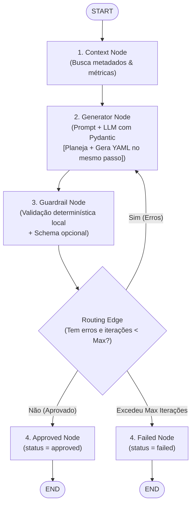

# Especificação Técnica de Arquitetura: Pipeline Harness Engine AI 🚀

## 1. Visão Geral & Decisões de Design

Esta especificação define o redesenho arquitetural do motor **`pipeline-harness-ai`** para atingir o estado da arte em **AI Engineering** e **Harness Engineering**.

### Decisões Fundamentais Firmadas:

1. **Separação entre Metadados da Fonte (Postgres da Plataforma) e Decisões de DW (Inteligência LLM):**
   - **Metadados da Fonte (Fact & Registry):** Informações técnicas sobre a origem (dialeto SQL do banco fonte, tipo de criptografia de arquivo, delimitadores cadastrados, método de autenticação de API) são **fatos registrados no PostgreSQL da plataforma** e injetados diretamente via [MetadataPort](file:///c:/Users/natha/Documents/Estudo/pipeline-harness-ai/src/domain/ports.py#L39-L44). A LLM não adivinha a tecnologia da fonte.
   - **Estratégia de Carga & Particionamento no Data Warehouse (Inteligência LLM):** A responsabilidade primária da LLM no `PlannerNode` é analisar os metadados da fonte + prompt do usuário + volume histórico e **decidir a estratégia de engenharia no destino (DW)**:
     - Estratégia de Carga (`full_load` vs `incremental` vs `cdc`).
     - Definição do Particionamento no Data Warehouse (`partition_column`, granularidade).
     - Escolha da Coluna de Watermark para extrações incrementais.
     - Regras de Deduplicação, Chaves de Merge e Dimensionamento do Motor de Computação.

2. **Desacoplamento & Autoridade Única do Contrato (Clean Architecture):**
   - A plataforma [`clean-data-platform-airflow`](https://github.com/Melo-Anderson/clean-data-platform-airflow) é a **Single Source of Truth** do contrato do pipeline (JSON Schema, validações de SQL, criptografia, delimitação e regras do ecossistema).
   - O `pipeline-harness-ai` **NÃO duplica** código de validação nem parsers de SQL hardcoded. Em vez disso, consome a API de validação e o JSON Schema oficial da plataforma via a porta [PlatformSchemaPort](file:///c:/Users/natha/Documents/Estudo/pipeline-harness-ai/src/domain/ports.py#L52-L56) e a nova porta `PlatformValidationPort` (endpoint `/v1/harness/validate`).
   - Reutiliza 100% da engine de validação que já roda no CI da plataforma. Cualquier mudança no schema ou nas regras de validação de SQL do CI reflete instantaneamente na validação determinística do Harness.

3. **Feedback Loop Enriquecido (Feedforward Contextualizado):**
   - Os erros de validação capturados no nó de Guardrails são transformados em mensagens altamente instrutivas antes de retornarem para a LLM.
   - Cada erro contém: **Caminho exato no JSON/YAML (JSON Pointer)**, **Valor recebido vs Esperado**, **Regra de negócio/Schema violada** e **Orientação corretiva**.
   - Isso impede que a LLM receba feedback genérico ou fique presa em loops de tentativas infrutíferas.

4. **Separação Estrita de Responsabilidades no LangGraph:**
   - Separação clara entre **Planejamento Conceitual** (`PlannerNode`), **Geração de Código/YAML** (`GeneratorNode`), **Validação Determinística em 2 Camadas** (`GuardrailNode`), **Aprimoramento de Erros** (`FeedbackEnricherNode`), **Aprovação Humana** (`HITLGateNode`) e **Emissão com Auditoria Imutável** (`AuditExporterNode`).

---

## 2. Desenho do Fluxo do LangGraph: ANTES vs DEPOIS

### 2.1 Fluxo Atual (ANTES)

No fluxo atual, o planejamento e a geração ocorrem em um único passo acoplado no `generator_node`. Os erros de validação são repassados de forma direta e a validação do contrato da plataforma depende de contextos opcionais.



---

### 2.2 Novo Fluxo Proposto (DEPOIS - Enterprise Flow)

No novo fluxo, o processo é dividido em etapas especializadas com contratos bem definidos e total rastreabilidade.

```mermaid
flowchart TD
    Start([START]) --> ContextNode["1. Context Node\n- Busca metadados técnicos no Postgres da Plataforma (dialeto, criptografia, colunas, PII)\n- Consome PlatformSchemaPort (JSON Schema por tipo)\n- Consome MetricsPort (Volume histórico em GB)\n- Consome PlatformExamplesPort (Gold Examples por tipo)"]
    
    ContextNode --> PlannerNode["2. Planner Node (Inteligência de DW & Carga)\n- Recebe metadados reais da fonte (Postgres)\n- Decide Estratégia de Carga no DW: full_load vs incremental vs cdc\n- Seleciona Coluna de Watermark e Particionamento no Data Warehouse\n- Estima tamanho de lote (page_size) e num_workers com base no volume em GB\n- Define regras de deduplicação e qualidade no destino\n- Gera objeto estruturado: PipelinePlan"]
    
    PlannerNode --> GeneratorNode["3. Generator Node\n- Recebe PipelinePlan + Gold Examples do Tipo\n- Aplica prompt especializado em síntese YAML\n- Gera objeto canonico Pydantic: PipelineSpec\n- Exporta YAML sintático primário com queries/params"]
    
    GeneratorNode --> GuardrailNode["4. Dual-Layer Guardrail Node\n- Layer 1: Validação remota via PlatformValidationPort (/v1/harness/validate)\n  (Roda a mesma suite do CI da plataforma: validação de SQL, schemas, separadores, etc.)\n- Layer 2: Validação de Regras de Governança & Segurança Locais"]
    
    GuardrailNode --> CheckStatus{"Validação Passou?"}
    
    CheckStatus -- "Não (Erros)" --> EnricherNode["5. Enriched Feedback Node\n- Converte erros crus do CI/Plataforma em mensagens estruturadas (JSON Pointer + Regra + Dica)\n- Incrementa contador de iterações\n- Prepara prompt de refatoração para LLM"]
    
    EnricherNode --> CheckMaxIter{"Iterações <= Max?"}
    CheckMaxIter -- "Sim" --> GeneratorNode
    CheckMaxIter -- "Não" --> FailedNode["Status: Failed Max Iterations"] --> AuditExporterFailed["Audit & Exporter Node\n(Salva histórico de falha)"] --> EndFailed([END])
    
    CheckStatus -- "Sim (Sem erros)" --> HITLNode["6. Human-in-the-Loop (HITL) Gate\n- Gera diff da alteração em relação ao plano\n- Permite aprovação do usuário via CLI/API\n- Opção de auto-approve em modo CI"]
    
    HITLNode --> HITLDecision{"Aprovado pelo Usuário?"}
    HITLDecision -- "Rejeitado/Refazer" --> EnricherNode
    HITLDecision -- "Aprovado" --> AuditExporterNode["7. Audit & Exporter Node\n- Emite arquivo final: pipeline.yaml\n- Gera artefato JSON imutável: audit_metadata.json\n  (Prompt snapshot, tokens, latency, iterations, git sha)"]
    
    AuditExporterNode --> EndApproved([END])
```



---

## 3. Detalhamento das Responsabilidades: Metadados da Fonte vs Decisões da LLM

### 3.1 Fonte de Verdade dos Dados (Origem vs Destino)

| Componente de Dados | Origem da Informação | Componente Responsável |
|---|---|---|
| **Dialeto SQL do Banco Origem** (Oracle/Postgres/MySQL) | Cadastro no PostgreSQL da Plataforma | `ContextNode` -> `MetadataPort` |
| **Formato e Criptografia de Arquivos** (CSV/Parquet, PGP, KMS) | Cadastro no PostgreSQL da Plataforma | `ContextNode` -> `MetadataPort` |
| **Autenticação e Headers de API** (OAuth2/API Key, Base URL) | Cadastro no PostgreSQL da Plataforma | `ContextNode` -> `MetadataPort` |
| **Estratégia de Carga no DW** (`full_load` vs `incremental` vs `cdc`) | Raciocínio Contextual do Agente AI | **`PlannerNode` (LLM)** |
| **Particionamento no Data Warehouse** (`partition_column`, granularidade) | Raciocínio Contextual do Agente AI | **`PlannerNode` (LLM)** |
| **Coluna de Watermark & Deduplicação** (`watermark_column`, `primary_key`) | Análise de Colunas (pki/indexed/dates) | **`PlannerNode` (LLM)** |
| **Dimensionamento do Motor de Computação** (engine, `num_workers`) | Volume Histórico (GB) + Frequência | **`PlannerNode` (LLM)** |

---

### 3.2 Reutilização da Engine de Validação do CI da Plataforma (`/v1/harness/validate`)

Para evitar a duplicação de validadores de SQL ou parsers de regras de arquivo dentro do Harness, a arquitetura estabelece que:

1. **A Plataforma (`clean-data-platform-airflow`)** expõe o endpoint de API `/v1/harness/validate` contendo a mesma suíte de testes que roda no seu CI.
2. O **Harness (`pipeline-harness-ai`)** consome este endpoint através do nó `GuardrailNode` enviando o payload:
   ```json
   {
     "pipeline_yaml": "...",
     "pipeline_type": "relational"
   }
   ```
3. A resposta do endpoint devolve o relatório estruturado de erros:
   ```json
   {
     "is_valid": false,
     "errors": [
       {
         "json_pointer": "/source/objects/0/extraction_query",
         "error_code": "INVALID_SQL_SYNTAX",
         "message": "Syntax error near 'LIMIT': Expected SELECT statement without trailing semicolon",
         "suggestion": "Remova o ponto e vírgula no final da query SQL de extração."
       }
     ]
   }
   ```
4. O `EnrichedFeedbackNode` do Harness consome esse JSON de erro e injeta o contexto no prompt de refinamento da LLM na iteração seguinte.

---

## 4. Requisitos de Implementação no Harness (`pipeline-harness-ai`)

Para executar o plano de desenvolvimento dessa arquitetura, os seguintes entregáveis técnicos deverão ser criados no repositório do Harness:

1. **Modelos Pydantic Adicionais (`src/domain/schemas/`):**
   - `PipelinePlan` (Estrutura do nó de planejamento contendo a classificação do tipo de pipeline e decisões de carga/DW).
   - `AuditTrail` (Estrutura de exportação de métricas e rastreabilidade).
   - `EnrichedError` (Estrutura de erro com JSON Pointer e orientação corretiva).

2. **Novas Portas de Domínio (`src/domain/ports.py`):**
   - `PlatformValidationPort`: Porta abstrata com o método `validate_pipeline_yaml(yaml_content: str, pipeline_type: str) -> ValidationResult`.
   - Atualização do `PlatformExamplesPort` para aceitar filtro por `pipeline_type`.

3. **Refatoração do Grafo do LangGraph (`src/application/graph/`):**
   - `planner_node.py` (Lógica focada na escolha de `load_strategy`, `partition_column`, `watermark_column` e sizing de DW).
   - `enricher_node.py`
   - `hitl_node.py`
   - `audit_node.py`
   - Atualização do `workflow.py` e `edges.py`.

4. **Suíte de Testes e Benchmarking (`tests/`):**
   - `tests/unit/test_planner_node.py`
   - `tests/unit/test_enricher_node.py`
   - `tests/benchmarks/test_regression_ast.py`: Teste de regressão comparando igualdade de ASTs (`PipelineSpec`).

---

## 5. Requisitos & Contrato de Interface para a Plataforma (`clean-data-platform-airflow`)

Para que a integração funcione perfeitamente sem quebras de contrato, o repositório da plataforma deverá fornecer/expor três endpoints da API Harness:

### 5.1 `GET /v1/harness/schema?type={relational|file|api|all}`
- **Objetivo:** Retornar a definição JSON Schema oficial do contrato YAML da plataforma.
- **Suporte:** Deve aceitar o parâmetro opcional `type` para filtrar sub-schemas específicos ou devolver o schema completo quando `type=all`.

### 5.2 `GET /v1/harness/gold-examples?type={relational|file|api|all}`
- **Objetivo:** Retornar exemplos canônicos de YAMLs válidos e recomendados pela engenharia da plataforma.

### 5.3 `POST /v1/harness/validate` (Reuso da Engine do CI)
- **Objetivo:** Executar a suíte completa de validações determinísticas da plataforma (a mesma executada nas pipelines de CI/CD para deploy no Airflow).

---

## 6. Estratégia de Versionamento e Compatibilidade (Garantia de Não Quebrar a Integração)

1. **Header de Versão do Contrato (`X-Harness-Contract-Version: 1.0`):** Mapeamento estrito de versão HTTP entre os repositórios.
2. **Adaptadores de Mock/Fallback Local (`MockPlatformValidationAdapter`):** Mocks estáticos locais no Harness para permitir testes isolados sem dependência runtime da API da plataforma.
3. **Validação de Schema Unificada nos Testes de Integração:** Contrato JSON sincronizado via CI.
