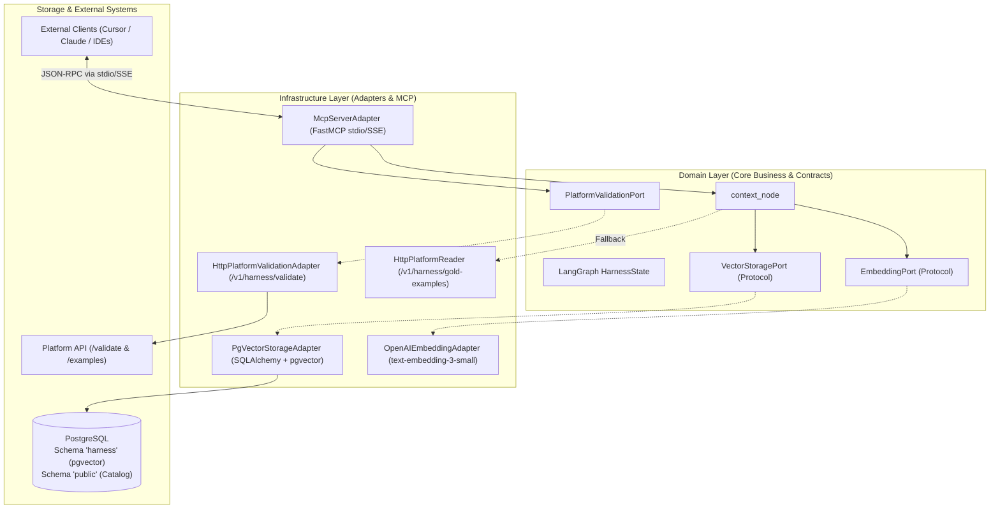
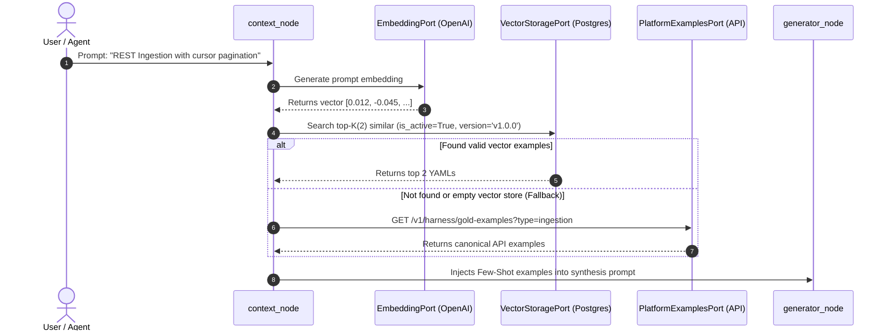

# Technical Architecture Specification: Semantic RAG (pgvector) & MCP Server (Model Context Protocol) 🚀

> **Date:** August 20, 2026  
> **Status:** Approved & Aligned with User  
> **Project:** `pipeline-harness-ai`  
> **Author / Team:** AI Engineering & Data Platform  

---

## 1. 📌 Consolidated Architectural Decisions

Based on the engineering design and alignment process, the following guidelines were established:

1. **Dedicated PostgreSQL Schema (`harness`) with Local Alembic:**
   - Harness vector tables and indexes are created inside a dedicated schema (`harness.gold_pipeline_embeddings`), isolated from platform core tables (`public.data_assets`, `public.data_elements`).
   - DDL versioning and HNSW index management are handled by **Alembic** within the `pipeline-harness-ai` repository.
2. **Hierarchical Integration with Fallback (RAG + API):**
   - `context_node` prioritizes semantic vector search in `pgvector`. When no matches satisfy the similarity threshold or the table is empty, it falls back transparently to the `/v1/harness/gold-examples` platform API.
3. **Active Governance and Hybrid Lifecycle:**
   - Newly approved YAML specifications in `audit_node` are automatically vectorized and persisted in the database.
   - CLI auto-revalidation routine (`revalidate-memory`) periodically submits active YAMLs against the `/v1/harness/validate` endpoint, deactivating (`is_active = FALSE`) examples that suffered *Schema Drift*.
4. **Dual-Transport MCP Server:**
   - Support for `stdio` (local integration with Cursor, Claude Desktop, and VS Code) and `SSE/HTTP` (for containerized microservices and enterprise agents).
5. **Native Observability with LangSmith:**
   - Native tracing enabled via environment variables (`LANGCHAIN_TRACING_V2=true`), capturing node latency and token consumption without code coupling.

---

## 2. 🏗️ Architecture Design (Clean Architecture)



---

## 3. 🧠 RAG Module & Vector Memory (`pgvector`)

### 3.1 Migration DDL (Alembic in `harness` Schema)

```sql
-- 1. Create Dedicated Schema
CREATE SCHEMA IF NOT EXISTS harness;

-- 2. Enable Vector Extension
CREATE EXTENSION IF NOT EXISTS vector;

-- 3. Semantic Memory Table
CREATE TABLE harness.gold_pipeline_embeddings (
    id UUID PRIMARY KEY DEFAULT gen_random_uuid(),
    platform_schema_version VARCHAR(20) NOT NULL DEFAULT 'v1.0.0',
    pipeline_type VARCHAR(50) NOT NULL,            -- 'ingestion', 'etl', 'export'
    compute_engine VARCHAR(50) DEFAULT 'spark',    -- 'spark', 'duckdb', 'dbt', etc.
    description TEXT NOT NULL,                     -- Natural language pipeline summary
    yaml_content TEXT NOT NULL,                    -- Full valid YAML
    embedding vector(1536) NOT NULL,               -- Generated embedding (e.g. text-embedding-3-small)
    is_active BOOLEAN DEFAULT TRUE,                -- Flag for schema drift invalidation
    last_validated_at TIMESTAMP WITH TIME ZONE DEFAULT NOW(),
    created_at TIMESTAMP WITH TIME ZONE DEFAULT NOW()
);

-- 4. HNSW Index for Low-Latency Search (< 5ms)
CREATE INDEX IF NOT EXISTS idx_gold_pipeline_embeddings_hnsw 
ON harness.gold_pipeline_embeddings USING hnsw (embedding vector_cosine_ops)
WHERE is_active = TRUE;
```

---

### 3.2 Flow in `context_node` (Hierarchical with Fallback)



---

### 3.3 Auto-Revalidation & Schema Drift Prevention

```mermaid
flowchart TD
    A[Trigger: CLI 'revalidate-memory' or Scheduled Job] --> B[Fetch all YAMLs in harness.gold_pipeline_embeddings with is_active = TRUE]
    B --> C[Submit each YAML to API: POST /v1/harness/validate]
    C --> D{Is YAML still 100% valid on Platform?}
    D -- Yes --> E[Update last_validated_at = NOW()]
    D -- No (Contract Changed) --> F[Set is_active = FALSE<br/>Log warning with validation errors]
    E --> G[End of Self-Healing Routine]
    F --> G
```

---

## 4. 🔌 MCP Server Module (Model Context Protocol)

### 4.1 MCP Tools Definition

| MCP Tool | Input Parameters | Description |
|---|---|---|
| `get_table_schema` | `asset_name: str`, `object_name: str` | Returns detailed schema of a catalog table/API with types, primary keys, and policy tags (PII). |
| `get_gold_examples` | `pipeline_type: str`, `query: str`, `limit: int = 2` | Fetches relevant pipeline examples using pgvector semantic RAG with fallback to the platform API. |
| `validate_pipeline_yaml` | `yaml_content: str`, `pipeline_type: str` | Executes deterministic validation against the platform API and returns structured errors. |
| `generate_pipeline_yaml` | `prompt: str`, `pipeline_type: str \| None` | Executes the full LangGraph workflow and returns the approved final YAML and audit trail. |

---

### 4.2 MCP Resources Definition

| Resource URI | Description |
|---|---|
| `schema://platform/{pipeline_type}` | Returns the official canonical JSON Schema for the specified pipeline type. |
| `catalog://assets/{asset_name}` | Lists all objects and tables registered under the specified asset. |
| `audit://executions/{run_id}` | Returns the audit file (`_audit.json`) and generated YAML for a specific execution run ID. |

---

## 5. 📁 File Structure

```
src/
├── domain/
│   ├── ports.py                     # + VectorStoragePort, EmbeddingPort
│   └── schemas/
│       ├── harness_models.py        # + VectorSearchResult, GoldEmbeddingRecord
│       └── pipeline_spec.py
├── infrastructure/
│   ├── adapters/
│   │   ├── pgvector_storage.py      # Implements VectorStoragePort ('harness' schema)
│   │   ├── openai_embeddings.py     # Implements EmbeddingPort
│   │   ├── db_schema_reader.py
│   │   └── http_platform_validation.py
│   ├── db/
│   │   ├── alembic/                 # Migrations managed by Alembic
│   │   └── alembic.ini
│   ├── mcp/
│   │   ├── __init__.py
│   │   ├── server.py                # FastMCP server (stdio and SSE)
│   │   ├── tools.py                 # MCP Tools mapping
│   │   └── resources.py             # MCP Resources mapping
│   └── cli.py                       # + Commands: reindex-gold-examples, revalidate-memory
tests/
├── unit/
│   ├── test_pgvector_storage.py     # Unit tests with vector mocks
│   ├── test_embeddings_adapter.py   # Embedding generator tests
│   └── test_mcp_server.py           # MCP tools and resources tests
└── integration/
    └── test_rag_context_node.py     # Integration test for context_node + RAG
```
