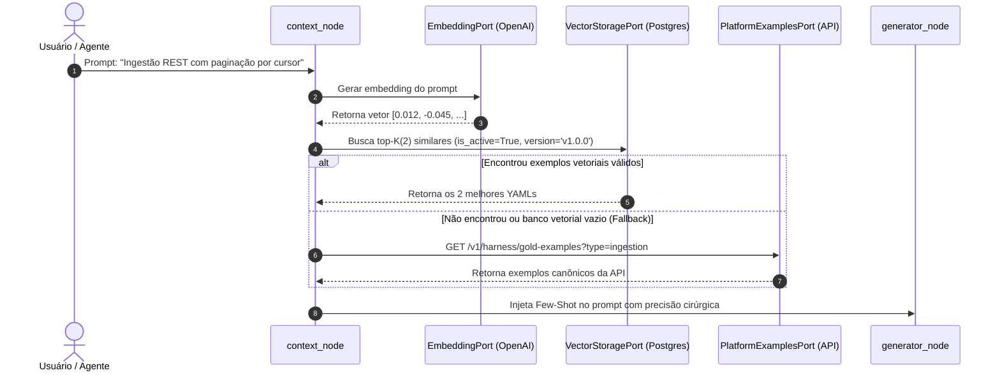

# Especificação Técnica de Arquitetura: RAG Semântico (pgvector) & Servidor MCP (Model Context Protocol) 🚀

> **Data:** 20 de Agosto de 2026  
> **Status:** Aprovado & Alinhado com o Usuário (/grill-me)  
> **Projeto:** `pipeline-harness-ai`  
> **Autor / Time:** Engenharia de IA & Plataforma de Dados  

---

## 1. 📌 Decisões Arquiteturais Consolidadas

Com base no processo de design e alinhamento de engenharia, foram firmadas as seguintes diretrizes:

1. **Schema PostgreSQL Dedicado (`harness`) com Alembic Local:**
   - As tabelas e índices vetoriais do Harness serão criadas dentro de um schema próprio (`harness.gold_pipeline_embeddings`), isoladas das tabelas da plataforma (`public.data_assets`, `public.data_elements`).
   - O versionamento das DDLs e índices HNSW será gerenciado pelo **Alembic** dentro do próprio repositório `pipeline-harness-ai`.
2. **Integração Hierárquica com Fallback (RAG + API):**
   - O `context_node` prioriza a busca vetorial semântica no `pgvector`. Caso não haja correspondências acima do threshold de similaridade ou a tabela esteja vazia, faz fallback transparente para a API `/v1/harness/gold-examples` da plataforma.
3. **Governança Ativa e Ciclo de Vida Híbrido:**
   - Novos YAMLs aprovados no `audit_node` são automaticamente vetorizados e armazenados no banco.
   - Rotina de auto-revalidação via CLI (`revalidate-memory`) submete periodicamente os YAMLs ativos contra o endpoint `/v1/harness/validate`, desativando (`is_active = FALSE`) exemplos que sofreram *Schema Drift*.
4. **Servidor MCP com Transporte Duplo:**
   - Suporte a `stdio` (integração local com Cursor, Claude Desktop e VS Code) e `SSE/HTTP` (para microsserviços e outros agentes corporativos em contêineres).
5. **Observabilidade Nativa com LangSmith:**
   - Tracing nativo ativado via variáveis de ambiente (`LANGCHAIN_TRACING_V2=true`), capturando nós, latência e consumo de tokens sem acoplamento de código.

---

## 2. 🏗️ Desenho de Arquitetura (Clean Architecture)


---

## 3. 🧠 Módulo RAG & Memória Vetorial (`pgvector`)

### 3.1 DDL da Migração (Alembic no Schema `harness`)

```sql
-- 1. Criação do Schema Dedicado
CREATE SCHEMA IF NOT EXISTS harness;

-- 2. Habilitação da Extensão Vetorial
CREATE EXTENSION IF NOT EXISTS vector;

-- 3. Tabela de Memória Semântica
CREATE TABLE harness.gold_pipeline_embeddings (
    id UUID PRIMARY KEY DEFAULT gen_random_uuid(),
    platform_schema_version VARCHAR(20) NOT NULL DEFAULT 'v1.0.0',
    pipeline_type VARCHAR(50) NOT NULL,            -- 'ingestion', 'etl', 'export'
    compute_engine VARCHAR(50) DEFAULT 'spark',    -- 'spark', 'duckdb', 'dbt', etc.
    description TEXT NOT NULL,                     -- Resumo do pipeline em linguagem natural
    yaml_content TEXT NOT NULL,                    -- YAML completo válido
    embedding vector(1536) NOT NULL,               -- Vetor gerado (ex: text-embedding-3-small)
    is_active BOOLEAN DEFAULT TRUE,                -- Flag para invalidação em schema drift
    last_validated_at TIMESTAMP WITH TIME ZONE DEFAULT NOW(),
    created_at TIMESTAMP WITH TIME ZONE DEFAULT NOW()
);

-- 4. Índice HNSW para Busca em Baixa Latência (< 5ms)
CREATE INDEX IF NOT EXISTS idx_gold_pipeline_embeddings_hnsw 
ON harness.gold_pipeline_embeddings USING hnsw (embedding vector_cosine_ops)
WHERE is_active = TRUE;
```

---

### 3.2 Fluxo no `context_node` (Hierárquico com Fallback)



---

### 3.3 Mecanismo de Auto-Revalidação e Prevenção de Schema Drift

```mermaid
flowchart TD
    A[Disparo: CLI 'revalidate-memory' ou Job Agendado] --> B[Buscar todos YAMLs em harness.gold_pipeline_embeddings com is_active = TRUE]
    B --> C[Passar cada YAML pela API: POST /v1/harness/validate]
    C --> D{O YAML continua 100% válido na Plataforma?}
    D -- Sim --> E[Atualizar last_validated_at = NOW()]
    D -- Não (Regra Mudou) --> F[Marcar is_active = FALSE<br/>Registrar warning com os erros da regra]
    E --> G[Fim do Processo de Auto-Cura]
    F --> G
```

---

## 4. 🔌 Módulo Servidor MCP (Model Context Protocol)

### 4.1 Definição de Ferramentas (Tools) do MCP

| Tool MCP | Parâmetros de Entrada | Descrição |
|---|---|---|
| `get_table_schema` | `asset_name: str`, `object_name: str` | Retorna o schema detalhado de uma tabela/API do catálogo com tipos, PKs e policy_tags (PII). |
| `get_gold_examples` | `pipeline_type: str`, `query: str`, `limit: int = 2` | Busca os exemplos mais aderentes usando RAG semântico no `pgvector` com fallback para a API. |
| `validate_pipeline_yaml` | `yaml_content: str`, `pipeline_type: str` | Executa a validação determinística na API da plataforma e retorna os erros estruturados. |
| `generate_pipeline_yaml` | `prompt: str`, `pipeline_type: str \| None` | Executa o grafo completo do LangGraph e retorna o YAML final aprovado e a trilha de auditoria. |

---

### 4.2 Definição de Recursos (Resources) do MCP

| URI do Resource | Descrição |
|---|---|
| `schema://platform/{pipeline_type}` | Retorna o JSON Schema canônico oficial para o tipo de pipeline. |
| `catalog://assets/{asset_name}` | Lista todos os objetos e tabelas cadastrados no asset especificado. |
| `audit://executions/{run_id}` | Retorna o arquivo de auditoria (`_audit.json`) e o YAML gerado para a execução. |

---

## 5. 📁 Nova Estrutura de Arquivos Proposta

```
src/
├── domain/
│   ├── ports.py                     # + VectorStoragePort, EmbeddingPort
│   └── schemas/
│       ├── harness_models.py        # + VectorSearchResult, GoldEmbeddingRecord
│       └── pipeline_spec.py
├── infrastructure/
│   ├── adapters/
│   │   ├── pgvector_storage.py      # [NOVO] Implementa VectorStoragePort (schema 'harness')
│   │   ├── openai_embeddings.py     # [NOVO] Implementa EmbeddingPort
│   │   ├── db_schema_reader.py
│   │   └── http_platform_validation.py
│   ├── db/
│   │   ├── alembic/                 # [NOVO] Migrations gerenciadas pelo Alembic
│   │   └── alembic.ini
│   ├── mcp/
│   │   ├── __init__.py
│   │   ├── server.py                # [NOVO] Servidor FastMCP (stdio e SSE)
│   │   ├── tools.py                 # [NOVO] Mapeamento de Tools MCP
│   │   └── resources.py             # [NOVO] Mapeamento de Resources MCP
│   └── cli.py                       # + Comandos: reindex-gold-examples, revalidate-memory
tests/
├── unit/
│   ├── test_pgvector_storage.py     # [NOVO] Testes unitários com mocks vetoriais
│   ├── test_embeddings_adapter.py   # [NOVO] Testes do gerador de embeddings
│   └── test_mcp_server.py           # [NOVO] Testes de ferramentas e recursos MCP
└── integration/
    └── test_rag_context_node.py     # [NOVO] Teste de integração do context_node + RAG
```
